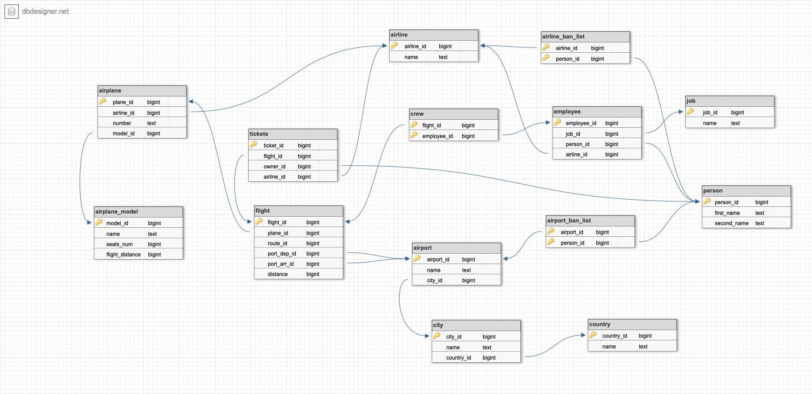

# ER-модель

## Предметная область

Предметной областью данной базы данных будет **Авиаперелеты**

## Ключевые сущности

- Аэропорт
- Самолет
- Рейс
- Билет
- Авиакомпания
- Экипаж
- Пассажир

## Описание связей

1) **Рейс - Самолет**

Каждый рейс проходит на ровно одном самолете. При этом самолет может быть привязан к нескольким рейсам (в непересекающиеся периоды времени)

2) **Рейс - Аэропорт**

Рейс проводится между двумя аэропортами (возможно есть смысл сделать это просто полем). При этом аэропорт может быть привязан к любому кол-ву рейсов.

3) **Рейс - Билет**

Билет явно на какой-то рейс (если это не билет в цирк). При этом на рейс может быть продано любое кол-во билетов (рейс может быть пустым)

4) **Рейс - Авиакомпания**

На рейсе могут быть зарегистрированы билеты разных авикомпаний. При этом авикомпания, очевидно, продает билеты на много рейсов

5) **Рейс - Экипаж**

На рейсе есть много экипажа (стюардессы, пилоты). При этом экипаж может быть новым и не привязан еще ни к одному рейсу

6) **Билет - Пассажир**

Билет может быть зарегистрирован на одного пассажира. При этом пассажир может не покупать ни разу ни одного билета

7) **Аэропорт - Пассажир**

Пассажир может быть в бан листе многих аэропортов. У аэропорта может быть бан лист

8) **Авиакомпания - Пассажир**

Пассажир может быть в бан листе многих авиакомпаний. У авиакомпании может быть бан лист.

9)  **Самолет - Авиакомпания**

У авиакомпании есть много самолетов (логично что хотя бы один есть, хотя бы кукурзник). При этом самолет точно привязан к какой-то авиакомпании

10)  **Авиакомпания - Экипаж**

В авиакомпании работает какой-то экипаж. При этом каждый член экипажа работает ровно в одной авиакомпании

11)  **Билет - Авиакомпания**

Билет привязан к какой-то авиакомпании. Эта связь нужна, так как по рейсу не понятно это билет какой именно авиакомпании

12) **Аэропорт - Авиакомпания**

Авиакомпания базируется в каких-то аэропортах (они не бомжи, у них точно есть один). При этом в аэропорту может базироваться несколько авиакомпаний (может быть 0)

## Визуальная картина в ER-нотации

## Диаграмма таблиц

