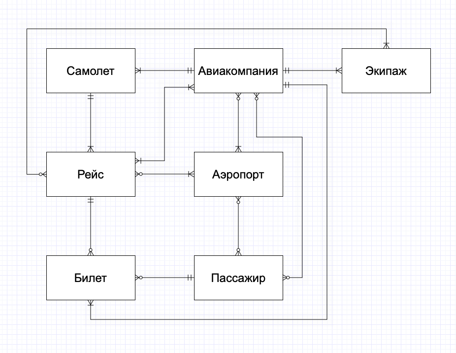

# ER-модель

## Предметная область

Предметной областью данной базы данных будет **Авиаперелеты**

## Ключевые сущности

- Аэропорт
- Самолет
- Рейс
- Билет
- Авиакомпания
- Персонал
- Пассажир

## Визуальная картина в ER-нотации

