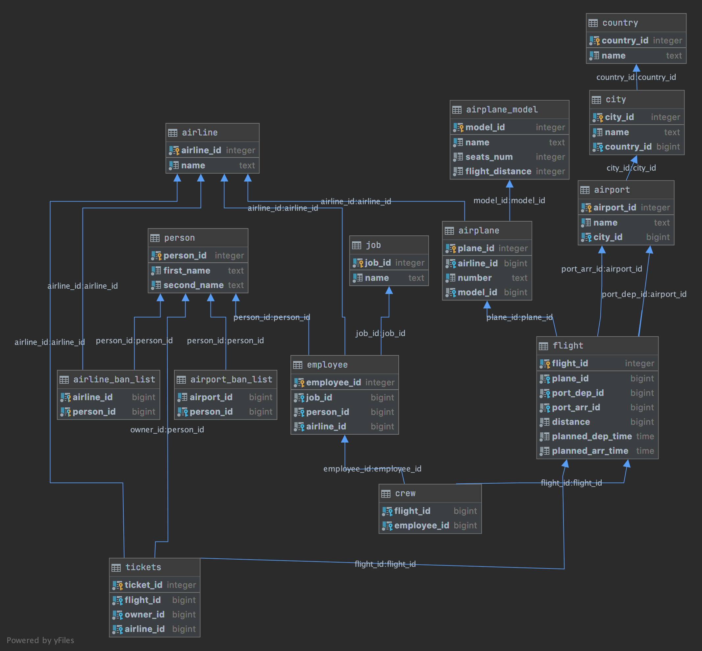

# Логистическая модель

# Описание физической модели

## Person / Личность
| Название        | Описание             | Тип данных  |  Ограничение |
| --------------- |:--------------------:|:-----------:| ------------ |
| person_id       | id человека          | bigint      | pk, not null |
| first_name      | Имя человека         | text        | not null     |
| second_name     | Фамилия человека     | bigint      | not null     |

---

## Job / Должность

| Название        | Описание             | Тип данных  |  Ограничение |
| --------------- |:--------------------:|:-----------:| ------------ |
| job_id          | id должности         | bigint      | pk, not null |
| name            | Название должности   | text        | not null     |

---

## Airline / Авиакомпания

| Название        | Описание             | Тип данных  |  Ограничение |
| --------------- |:--------------------:|:-----------:| ------------ |
| airline_id      | id авиакомпании      | bigint      | pk, not null |
| name            | Название авиакомании | text        | not null     |

---

## Employee / Сотрудник

| Название        | Описание             | Тип данных  |  Ограничение |
| --------------- |:--------------------:|:-----------:| ------------ |
| employee_id     | id сотрудника        | bigint      | pk, not null |
| job_id          | id должности         | text        | not null     |
| person_id       | id человека          | bigint      | not null     |
| airline_id      | id авиакомпании      | bigint      | not null     |

---

## Airline_ban_list / Бан-лист авиакомпании

| Название        | Описание             | Тип данных  |  Ограничение |
| --------------- |:--------------------:|:-----------:| ------------ |
| airline_id      | id авиакомпании      | bigint      | pk, not null |
| person_id       | id человека          | text        | pk, not null |

---

## Country / Страна

| Название        | Описание             | Тип данных  |  Ограничение |
| --------------- |:--------------------:|:-----------:| ------------ |
| country_id      | id страны            | bigint      | pk, not null |
| name            | Название страны      | text        | not null     |

---

## City / Город

| Название        | Описание                  | Тип данных  |  Ограничение |
| --------------- |:-------------------------:|:-----------:| ------------ |
| city_id         | id города                 | bigint      | pk, not null |
| name            | Название города           | text        | not null     |
| country_id      | id страны в котором город | bigint      | not null     |

---

## Airport / Аэропорт

| Название        | Описание                          | Тип данных  |  Ограничение |
| --------------- |:---------------------------------:|:-----------:| ------------ |
| airport_id      | id аэропорта                      | bigint      | pk, not null |
| name            | Название аэропорта                | text        | not null     |
| city_id         | id города в котором этот аэропорт | bigint      | not null     |

---

## Airport_ban_list / Бан-лист аэропорта

| Название        | Описание                  | Тип данных  |  Ограничение |
| --------------- |:-------------------------:|:-----------:| ------------ |
| airport_id      | id аэропорта              | bigint      | pk, not null |
| person_id       | id человека               | bigint      | pk, not null |

---

## Airplane_model / Модель самолета

| Название        | Описание                          | Тип данных  |  Ограничение |
| --------------- |:---------------------------------:|:-----------:| ------------ |
| model_id        | id модели                         | bigint      | pk, not null |
| name            | Название модели                   | text        | not null     |
| seats_num       | Кол-во мест в самолете            | bigint      | not null     |
| flight_distance | Макс. дальность полета            | bigint      | not null     |

---

## Airplane / Самолет (конкретный)

| Название        | Описание                          | Тип данных  |  Ограничение |
| --------------- |:---------------------------------:|:-----------:| ------------ |
| plane_id        | id самолета                       | bigint      | pk, not null |
| airline_id      | Авиакомпания самолета             | bigint      | not null     |
| number          | Порядковый номер самолета         | text        | not null     |
| model_id        | Модель самолета                   | bigint      | not null     |

---

## Flight / Рейс

| Название         | Описание                          | Тип данных  |  Ограничение |
| ---------------- |:---------------------------------:|:-----------:| ------------ |
| flight_id        | id рейса                          | bigint      | pk, not null |
| plane_id         | id самолета                       | bigint      | not null     |
| port_dep_id      | id аэропорта вылета               | bigint      | not null     |
| port_arr_id      | id aэропорта прибытия             | bigint      | not null     |
| distance         | Дистанция полета                  | bigint      | not null     |
| planned_dep_time | Время планируемого вылета         | time        | not null     |
| planned_arr_time | Время планируемого прилета        | time        | not null     |

---

## Ticket / Билет

| Название         | Описание                          | Тип данных  |  Ограничение |
| ---------------- |:---------------------------------:|:-----------:| ------------ |
| ticket_id        | id билета                         | bigint      | pk, not null |
| flight_id        | id рейса                          | bigint      | not null     |
| owner_id         | id человека                       | bigint      | not null     |
| airline_id       | id авиакомпании билета            | bigint      | not null     |

---

## Crew / Экипаж

| Название        | Описание                  | Тип данных  |  Ограничение |
| --------------- |:-------------------------:|:-----------:| ------------ |
| flight_id       | id рейса                  | bigint      | pk, not null |
| employee_id     | id сотрудника             | bigint      | not null     |
